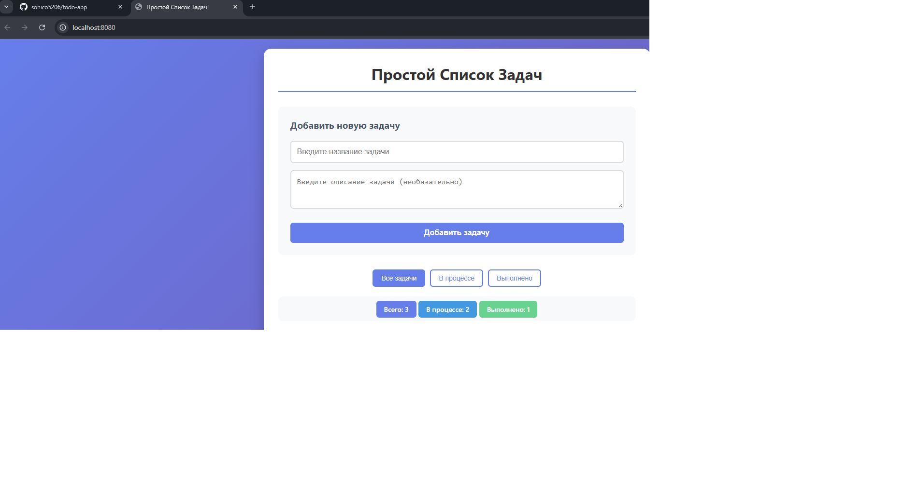

# Simple Todo App

Простое веб-приложение для управления задачами с полноценным бэкендом на Java и современным фронтендом.

Кулич София



## Технологический стек

### Backend
- Java - основной язык
- SQLite - база данных
- JDBC - работа с БД
- Gson - JSON сериализация
- Встроенный HTTP сервер Java

### Frontend
- HTML, CSS, JavaScript
- Fetch API для HTTP запросов
- Адаптивный дизайн (Flexbox)

## Функциональность

1. **Управление задачами:**
    - Добавление новых задач
    - Редактирование существующих
    - Отметка "в процессе" / "выполнено"
    - Удаление задач

2. **Фильтрация задач:**
    - Все задачи
    - Только в процессе
    - Только выполненные

3. **Статистика:**
    - Общее количество задач
    - Количество в процессе
    - Количество выполненных

## Архитектура проекта
todo-app/\
├── src/main/java/com/todo/\
│ ├── Main.java # Точка входа, HTTP сервер (порт 8080)\
│ ├── Task.java # Модель данных (id, title, description, completed)\
│ ├── TaskDAO.java # Работа с БД (CRUD операции)\
│ └── DatabaseManager.java # Создание БД, подключение\
├── src/main/webapp/\
│ ├── index.html # Главная страница\
│ ├── style.css # Стили и адаптивный дизайн\
│ └── app.js # Логика фронтенда, работа с API\
├── data/ # Автоматически создается при запуске\
│└── todo.db # SQLite база данных\
├── pom.xml # Maven конфигурация\
└── README.md # Документация


## Запуск с нуля

### Требования:
- Java 11 или выше
- Maven 3.6+

### Шаг 1: Клонирование
```bash
git clone https://github.com/ваш-логин/todo-app.git
cd todo-app
```
Шаг 2: Сборка
```bash
mvn clean compile
```
Шаг 3: Запуск
```bash
mvn exec:java
```
Шаг 4: Открыть в браузере\
Перейдите по адресу: http://localhost:8080


Возможные улучшения:
- 
- Возможность добавления даты, статуса, категорий
- Поиск по задачам
- Сортировка - по дате, статусу, названию
- Экспорт данных - CSV, JSON
- Темная тема - переключение тем
